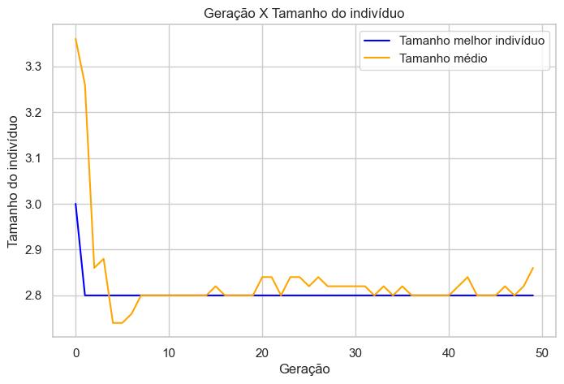

# Algoritmo genético para evolução de rede neural totalmente conectada

This project focuses on implementing a genetic algorithm to optimize a fully connected neural network. 

## Parâmetros:

Os seguintes parâmetros foram utilizados durante o processo de otimização:

| Parâmetro  | Valor |
| ------------- | ------------- |
| # Gerações  | 50  |
| Tamanho da População  | 10  |
| Elitismo  | True  |
| Tamanho máximo do indivíduo  | 6  |
| Taxa de Cruzamento  | 0.8  |
| Taxa de Mutação    | 0.2  |
| Tamanho do Torneio  | 2  |
| Etapas de treinamento  | 150  |

## Resultados

Um conjunto de visualizações é fornecido abaixo para ajudar a entender o processo de treinamento e os resultados obtidos. Os primeiros dois GIFs mostram a evolução do treinamento da rede e a melhor rede neural obtida. A seguir, existem três gráficos que representam a média da fitness, o desvio padrão da fitness e o tamanho do indivíduo ao longo das gerações, respectivamente.

  
   

